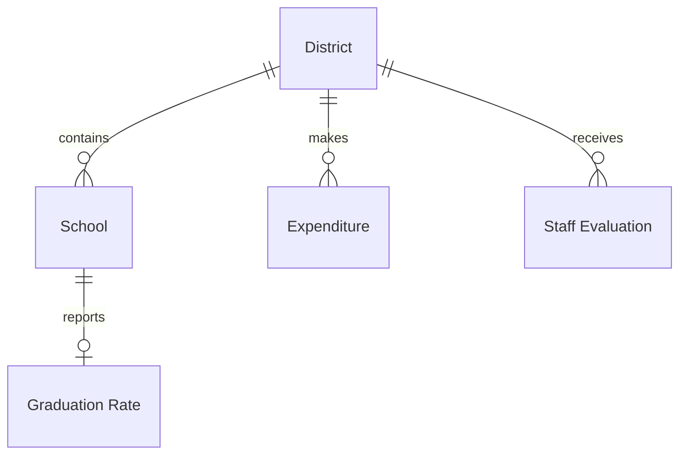

# DESE


## Problème à Résoudre

Vous venez de décrocher un nouvel emploi en tant qu'analyste de données pour l'État du Massachusetts, au sein du Département de l'Éducation Élémentaire et Secondaire (ou DESE, en abrégé !). Le DESE supervise le système éducatif public de l'État. L'une des responsabilités du DESE est de garantir que chaque enfant reçoive une éducation de qualité — une éducation dans laquelle ils rencontrent des enseignants expérimentés, ont accès à une abondance de ressources, et obtiennent finalement leur diplôme en ayant satisfait à toutes les exigences de l'État. Vos compétences en SQL ont un rôle à jouer dans ces nobles objectifs !

Dans une base de données appelée `dese.db`, répondez à des questions sur l'état de l'éducation dans le Massachusetts.

## Schéma

Dans le Massachusetts, l'éducation publique est déléguée à des districts, un type de gouvernement scolaire souvent associé à une ville individuelle. Ces districts contiennent à leur tour de nombreuses écoles individuelles. Considérez le diagramme de relation d'entité ci-dessous, qui codifie la relation entre les districts, les écoles et d'autres données collectées par le DESE.



### Table `districts`

La table `districts` contient les colonnes suivantes :

- `id`, qui est l'ID du district
- `name`, qui est le nom du district
- `type`, qui indique le type de district. Dans le Massachusetts, il existe des districts scolaires publics (désignés "Public School District") et des districts à charte (désignés "Charter District"). Pas besoin d'apprendre la différence, bien que vous puissiez le faire sur Wikipedia si vous êtes curieux !
- `city`, qui est la ville dans laquelle se trouve le district
- `state`, qui est l'État dans lequel se trouve le district
- `zip`, qui est le code postal dans lequel se trouve le district

### Table `schools`

La table `schools` contient les colonnes suivantes :

- `id`, qui est l'ID de l'école
- `district_id`, qui est l'ID du district auquel appartient l'école
- `name`, qui est le nom de l'école
- `type`, qui indique le type d'école. Dans le Massachusetts, il existe des écoles publiques (désignées "Public School") et des écoles à charte (désignées "Charter School"). Pas besoin d'apprendre la différence, bien que vous puissiez le faire sur Wikipedia si vous êtes curieux !
- `city`, qui est la ville dans laquelle se trouve l'école
- `state`, qui est l'État dans lequel se trouve l'école
- `zip`, qui est le code postal dans lequel se trouve l'école

### Table `graduation_rates`

La table `graduation_rates` contient les colonnes suivantes :

- `id`, qui est l'ID du taux de diplôme
- `school_id`, qui est l'ID de l'école associée au diplôme
- `graduated`, qui est le pourcentage d'élèves, de 0 à 100, qui ont obtenu leur diplôme à temps
- `dropped`, qui est le pourcentage d'élèves, de 0 à 100, qui ont abandonné l'école avant d'obtenir leur diplôme
- `excluded`, qui est le pourcentage d'élèves, de 0 à 100, qui ont été "exclus" (c'est-à-dire expulsés)

### Table `expenditures`

La table `expenditures` contient les colonnes suivantes :

- `id`, qui est l'ID de la dépense
- `district_id`, qui est l'ID du district associé à la dépense
- `pupils`, qui est le nombre d'élèves fréquentant le district donné
- `per_pupil_expenditure`, qui est le montant d'argent dépensé, en dollars, pour chaque élève fréquentant le district

### Table `staff_evaluations`

La table `staff_evaluations` contient les colonnes suivantes :

- `id`, qui est l'ID du rapport d'évaluation
- `district_id`, qui est l'ID du district associé à l'évaluation
- `evaluated`, qui est le pourcentage du personnel du district, de 0 à 100, formellement évalué
- `exemplary`, qui est le pourcentage du personnel du district, de 0 à 100, évalué comme "exemplaire"
- `proficient`, qui est le pourcentage du personnel du district, de 0 à 100, évalué comme "compétent"
- `needs_improvement`, qui est le pourcentage du personnel du district, de 0 à 100, évalué comme "ayant besoin d'amélioration"
- `unsatisfactory`, qui est le pourcentage du personnel du district, de 0 à 100, évalué comme "insatisfaisant"

## Spécification

Pour chacune des questions suivantes, vous devez écrire une seule requête SQL qui produit les résultats spécifiés par chaque problème. Votre réponse doit prendre la forme d'une seule requête SQL. Vous ne devez faire aucune supposition sur les `id` de lignes particulières : vos requêtes doivent être exactes même si les `id` étaient différents. Enfin, chaque requête ne doit retourner que les données nécessaires pour répondre à la question.

##### `1.sql`

Votre collègue prépare une carte de toutes les écoles publiques du Massachusetts. Dans `1.sql`, écrivez une requête SQL pour trouver les noms et les villes de toutes les écoles publiques du Massachusetts.

- Gardez à l'esprit que toutes les écoles de la table `schools` ne sont pas considérées comme des écoles publiques traditionnelles. Le Massachusetts reconnaît également les écoles privées (`charter schools`) qui (selon le DESE !) sont considérées comme distinctes.

##### `2.sql`

Votre équipe travaille à l'archivage d'anciennes données. Dans `2.sql`, écrivez une requête SQL pour trouver les noms des districts qui ne sont plus opérationnels.

- Les districts qui ne sont plus opérationnels ont "(non-op)" à la fin de leur nom.

##### `3.sql`

La législature du Massachusetts souhaite savoir combien d'argent, en moyenne, les districts ont dépensé par élève l'année dernière. Dans `3.sql`, écrivez une requête SQL pour trouver la dépense moyenne par élève. Nommez la colonne "per_pupil_expenditure".

- Notez que la colonne `per_pupil_expenditure` dans la table `expenditures` contient le montant moyen, par élève, que chaque district a dépensé l'année dernière. On vous a demandé de trouver la moyenne de cet ensemble de moyennes, en pondérant tous les districts de manière égale, quelle que soit leur taille.

##### `4.sql`

Certaines villes ont plus d'écoles publiques que d'autres. Dans `4.sql`, écrivez une requête SQL pour trouver les 10 villes avec le plus d'écoles publiques. Votre requête doit retourner les noms des villes et le nombre d'écoles publiques qu'elles contiennent, triés du plus grand nombre d'écoles publiques au plus petit. Si deux villes ont le même nombre d'écoles publiques, triez-les par ordre alphabétique.

##### `5.sql`

Le DESE souhaite que vous déterminiez dans quelles villes des écoles publiques supplémentaires pourraient être nécessaires. Dans `5.sql`, écrivez une requête SQL pour trouver les villes avec 3 écoles publiques ou moins. Votre requête doit retourner les noms des villes et le nombre d'écoles publiques qu'elles contiennent, triés du plus grand nombre d'écoles publiques au plus petit. Si deux villes ont le même nombre d'écoles publiques, triez-les par ordre alphabétique.

##### `6.sql`

Le DESE souhaite évaluer quelles écoles ont atteint un taux de diplôme de 100 %. Dans `6.sql`, écrivez une requête SQL pour trouver les noms des écoles (publiques ou à charte !) qui ont déclaré un taux de diplôme de 100 %.

##### `7.sql`

Le DESE prépare un rapport sur les écoles du district scolaire de Cambridge. Dans `7.sql`, écrivez une requête SQL pour trouver les noms des écoles (publiques ou à charte !) dans le district scolaire de Cambridge. Gardez à l'esprit que Cambridge, la ville, contient quelques districts scolaires, mais le DESE s'intéresse au district dont le nom est "Cambridge".

##### `8.sql`

Un parent souhaite envoyer son enfant dans un district avec de nombreux autres élèves. Dans `8.sql`, écrivez une requête SQL pour afficher les noms de tous les districts scolaires et le nombre d'élèves inscrits dans chacun.

##### `9.sql`

Un autre parent souhaite envoyer son enfant dans un district avec peu d'autres élèves. Dans `9.sql`, écrivez une requête SQL pour trouver le(s) nom(s) du ou des district(s) scolaire(s) avec le plus petit nombre d'élèves. Ne rapportez que le(s) nom(s).

##### `10.sql`

Dans le Massachusetts, les dépenses des districts scolaires sont en partie déterminées par les taxes locales sur les valeurs immobilières (par exemple, les valeurs des maisons). Dans `10.sql`, écrivez une requête SQL pour trouver les 10 districts scolaires publics avec les dépenses par élève les plus élevées. Votre requête doit retourner les noms des districts et la dépense par élève pour chacun.

##### `11.sql`

Y a-t-il une relation entre les dépenses scolaires et les taux de diplôme ? Dans `11.sql`, écrivez une requête SQL pour afficher les noms des écoles, leur dépense par élève et leur taux de diplôme. Triez les écoles de la plus grande dépense par élève à la plus petite. Si deux écoles ont la même dépense par élève, triez par nom d'école.

- Vous devez supposer qu'une école dépense le même montant par élève que l'ensemble de son district.

##### `12.sql`

Un parent vous demande conseil pour trouver les meilleurs districts scolaires publics du Massachusetts. Dans `12.sql`, écrivez une requête SQL pour trouver les districts scolaires publics avec des dépenses par élève supérieures à la moyenne et un pourcentage supérieur à la moyenne d'enseignants notés "exemplaires". Votre requête doit retourner les noms des districts, ainsi que leurs dépenses par élève et le pourcentage d'enseignants notés exemplaires. Triez les résultats d'abord par le pourcentage d'enseignants notés exemplaires (du plus élevé au plus bas), puis par la dépense par élève (du plus élevé au plus bas).

##### `13.sql`

Dans `13.sql`, écrivez une requête SQL pour répondre à une question que vous vous posez sur les données ! La requête doit :

- Impliquer au moins une `JOINTURE` ou une sous-requête

## Utilisation

Pour tester vos requêtes au fur et à mesure que vous les écrivez dans vos fichiers `.sql`, vous pouvez interroger la base de données en exécutant :

```
.read FILENAME
```

où `FILENAME` est le nom du fichier contenant votre requête SQL. Par exemple,

```
.read 1.sql
```

Vous pouvez également exécuter :

```
$ cat FILENAME | sqlite3 dese.db > output.txt
```

pour rediriger la sortie de la requête vers un fichier texte nommé `output.txt`. (Cela peut être utile pour vérifier combien de lignes sont retournées par votre requête !)
