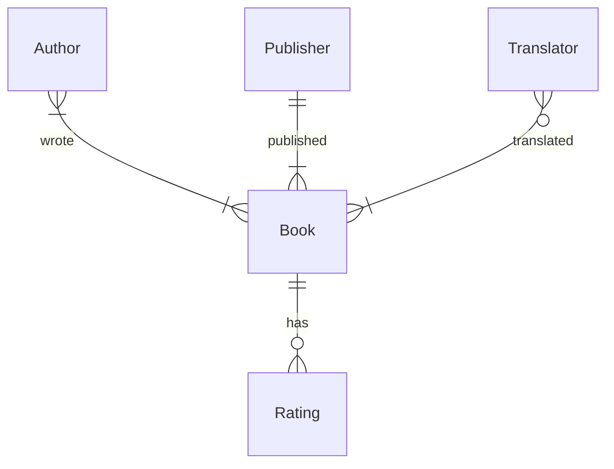

## Cours 2

- [Introduction](#introduction)
- [Diagrammes Entité-Relation](#diagrammes-entité-relation)
- [Clés](#clés)
  - [Clés Primaires](#clés-primaires)
  - [Clés Étrangères](#clés-étrangères)
- [Sous-requêtes](#sous-requêtes)
- [`IN`](#in)
- [`JOIN`](#join)
- [Ensembles](#ensembles)
- [Groupes](#groupes)
- [Fin](#fin)

## Introduction

- Les bases de données peuvent avoir plusieurs tables. Lors du dernier cours, nous avons vu une base de données de livres nominés pour le International Booker Prize. Nous allons maintenant voir que cette base de données contient de nombreuses tables différentes pour les livres, les auteurs, les éditeurs, etc.
- Tout d'abord, ouvrez la base de données en utilisant SQLite dans le terminal de votre Codespace.
- Nous pouvons utiliser la commande SQLite suivante pour voir toutes les tables de notre base de données :

```
.tables
```

Cette commande renvoie les noms des tables dans `longlist.db` — 7 au total.
- Ces tables ont certaines relations entre elles, nous appelons donc la base de données une base de données relationnelle. Regardez la liste des tables dans `longlist.db` et essayez d'imaginer les relations entre elles. Quelques exemples sont :
    - Les auteurs écrivent des livres.
    - Les éditeurs publient des livres.
    - Les livres sont traduits par des traducteurs.
- Considérons notre premier exemple. Voici un aperçu des tables `authors` et `books` avec les colonnes du nom de l'auteur et du titre du livre !


- Juste en regardant ces deux colonnes, comment pouvons-nous savoir qui a écrit quel livre ? Même si nous supposons que chaque livre est aligné à côté de son auteur, regarder uniquement la table `authors` ne nous donnerait aucune information sur les livres écrits par cet auteur.
- Certaines façons possibles d'organiser les livres et les auteurs sont…
    - le système d'honneur : la première ligne de la table `authors` correspondra toujours à la première ligne de la table `books`. Le problème avec ce système est que l'on peut faire une erreur (ajouter un livre mais oublier d'ajouter son auteur correspondant, ou vice versa). De plus, un auteur peut avoir écrit plus d'un livre ou un livre peut être co-écrit par plusieurs auteurs.
    - revenir à une approche à une seule table : Cette approche pourrait entraîner une redondance (duplication des données) si un auteur écrit plusieurs livres ou si un livre est co-écrit par plusieurs auteurs. Voici un aperçu de l'approche à une seule table avec certaines données redondantes.


- Après avoir considéré ces idées, il semble que la méthode la plus efficace soit d'avoir deux tables différentes. Examinons différentes façons dont les tables peuvent être liées entre elles dans les bases de données relationnelles.
- Considérons ce cas, où chaque auteur n'écrit qu'un seul livre et chaque livre est écrit par un seul auteur. Cela s'appelle une relation un-à-un.


- D'un autre côté, si un auteur peut écrire plusieurs livres, la relation est une relation un-à-plusieurs.


- Ici, nous voyons une autre situation où non seulement un auteur peut écrire plusieurs livres, mais les livres peuvent également être co-écrits par plusieurs auteurs. Cela s'appelle une relation plusieurs-à-plusieurs.


## Diagrammes Entité-Relation

- Nous venons de décrire les relations un-à-un, un-à-plusieurs et plusieurs-à-plusieurs entre les tables d'une base de données. Il est possible de visualiser de telles relations à l'aide d'un diagramme entité-relation (ER).
- Voici un diagramme ER pour les tables dans `longlist.db`.



- Chaque table est une entité dans notre base de données. Les relations entre les tables, ou entités, sont représentées par les verbes qui marquent les lignes reliant les entités.
- Chaque ligne de ce diagramme est en notation pied-de-corbeau.
    - La première ligne avec un cercle ressemble à un 0 marqué sur la ligne. Cette ligne indique qu'il n'y a pas de relations.
    - La deuxième ligne avec une ligne perpendiculaire ressemble à un 1 marqué sur la ligne. Une entité avec cette flèche doit avoir au moins une ligne qui lui est liée dans l'autre table.
    - La troisième ligne, qui ressemble à un pied-de-corbeau, a plusieurs branches. Cette ligne signifie que l'entité est liée à plusieurs lignes d'une autre table.


- Par exemple :
    - Nous lisons la notation de gauche à droite. Un auteur écrit un livre (ou, chaque auteur peut avoir un livre associé à lui).


    - Maintenant, non seulement un auteur écrit un livre, mais un livre est également écrit par un auteur.


    - Avec cet ajout, un auteur écrit au moins un livre et un livre est écrit par au moins un auteur. Pour reformuler, un auteur pourrait être associé à un ou plusieurs livres et un livre peut être écrit par un ou plusieurs auteurs.


- Revisitons le diagramme ER pour notre base de données.


- En observant les lignes reliant les entités Book et Translator, nous pouvons dire que les livres n'ont pas besoin d'avoir un traducteur. Ils pourraient avoir zéro à plusieurs traducteurs. Cependant, un traducteur dans la base de données traduit au moins un livre, et éventuellement plusieurs.

### Questions

> Si nous avons une certaine base de données, comment savons-nous les relations entre les entités qui y sont stockées ?

- Les relations exactes entre les entités dépendent vraiment du concepteur de la base de données. Par exemple, savoir si chaque auteur peut écrire un seul livre ou plusieurs livres est une décision à prendre lors de la conception de la base de données. Un diagramme ER peut être considéré comme un outil pour communiquer ces décisions à quelqu'un qui souhaite comprendre la base de données et les relations entre ses entités.

> Une fois que nous savons qu'une relation existe entre certaines entités, comment l'implémentons-nous dans notre base de données ?

- Nous verrons bientôt comment nous pouvons utiliser des clés en SQL pour lier les tables entre elles.

## Clés

### Clés Primaires

- Dans le cas des livres, chaque livre a un identifiant unique appelé un ISBN. En d'autres termes, si vous recherchez un livre par son ISBN, un seul livre sera trouvé. En termes de base de données, l'ISBN est une clé primaire — un identifiant qui est unique pour chaque élément d'une table.


- Inspiré par cette idée d'un ISBN, nous pouvons imaginer attribuer des ID uniques à nos éditeurs, auteurs et traducteurs ! Chacun de ces ID serait la clé primaire de la table à laquelle il appartient.

### Clés Étrangères

- Les clés aident également à lier les tables en SQL.
- Une clé étrangère est une clé primaire prise d'une table différente. En référençant la clé primaire d'une table différente, elle aide à lier les tables en formant un lien entre elles.


Remarquez comment la clé primaire de la table `books` est maintenant une colonne dans la table `ratings`. Cela aide à former une relation un-à-plusieurs entre les deux tables — un livre avec un titre (trouvé dans la table `books`) peut avoir plusieurs évaluations (trouvées dans la table `ratings`).
- L'ISBN, comme nous pouvons le voir, est un long identifiant. Si chaque caractère occupait un octet de mémoire, stocker un seul ISBN (y compris les tirets) prendrait 17 octets de mémoire, ce qui est beaucoup !
- Heureusement, nous n'avons pas nécessairement besoin d'utiliser l'ISBN comme clé primaire. Nous pouvons simplement construire la nôtre en utilisant des nombres comme 1, 2, 3… et ainsi de suite tant que chaque livre a un numéro unique pour l'identifier.
- Auparavant, nous avons vu comment implémenter la relation un-à-plusieurs entre les entités `books` et `ratings`. Voici un exemple de relation plusieurs-à-plusieurs.


Il y a maintenant une table appelée `authored` qui mappe la clé primaire de `books` (`book_id`) à la clé primaire de `authors` (`author_id`).

### Questions

> Les ID de l'auteur et du livre peuvent-ils être les mêmes ? Par exemple, si `author_id` est 1 et `book_id` est également 1 dans la table `authored`, y aura-t-il une confusion ?

- Les tables comme `authored` sont appelées tables "jointes" ou "de jonction". Dans de telles tables, nous savons généralement quelle clé primaire est référencée par quelle colonne. Dans ce cas, puisque nous savons que la première colonne contient uniquement la clé primaire de `authors` et que la deuxième colonne contient de même uniquement la clé primaire de `books`, ce serait correct même si les valeurs correspondaient !

> Si nous avons beaucoup de tables jointes comme celle-ci, cela ne prendrait-il pas trop de place ?

- Oui, il y a un compromis ici. Les tables comme celles-ci occupent plus d'espace mais elles nous permettent également d'avoir des relations plusieurs-à-plusieurs sans redondances, comme nous l'avons vu précédemment.

> Lors de la modification de l'ID d'un livre ou d'un auteur, l'ID est-il également mis à jour dans les autres tables ?

- Un ID mis à jour doit toujours être unique. Étant donné cela, les ID sont souvent abstraits et nous les modifions rarement.

## Sous-requêtes

- Une sous-requête est une requête à l'intérieur d'une autre requête. Ce sont également appelées requêtes imbriquées.
- Considérons cet exemple pour une relation un-à-plusieurs. Dans la table `books`, nous avons un ID pour indiquer l'éditeur, qui est une clé étrangère prise de la table `publishers`. Pour découvrir les livres publiés par Fitzcarraldo Editions, nous aurions besoin de deux requêtes — une pour découvrir le `publisher_id` de Fitzcarraldo Editions à partir de la table `publishers` et la deuxième, pour utiliser ce `publisher_id` pour trouver tous les livres publiés par Fitzcarraldo Editions. Ces deux requêtes peuvent être combinées en une seule en utilisant l'idée d'une sous-requête.

```
SELECT "title"
FROM "books"
WHERE "publisher_id" = (
    SELECT "id"
    FROM "publishers"
    WHERE "publisher" = 'Fitzcarraldo Editions'
);
```

Remarquez que :

    - La sous-requête est entre parenthèses. La requête la plus profonde dans les parenthèses sera exécutée en premier, suivie des requêtes extérieures.
    - La requête intérieure est indentée. Cela est fait selon les conventions de style pour les sous-requêtes, afin d'augmenter la lisibilité.
- Pour trouver toutes les évaluations du livre In Memory of Memory

```
SELECT "rating"
FROM "ratings"
WHERE "book_id" = (
    SELECT "id"
    FROM "books"
    WHERE "title" = 'In Memory of Memory'
);
```
- Pour sélectionner uniquement l'évaluation moyenne de ce livre

```
SELECT AVG("rating")
FROM "ratings"
WHERE "book_id" = (
    SELECT "id"
    FROM "books"
    WHERE "title" = 'In Memory of Memory'
);
```
- L'exemple suivant concerne les relations plusieurs-à-plusieurs. Pour trouver le(s) auteur(s) qui a(ont) écrit le livre Flights, trois tables devraient être interrogées : `books`, `authors` et `authored`.

```
SELECT "name"
FROM "authors"
WHERE "id" = (
    SELECT "author_id"
    FROM "authored"
    WHERE "book_id" = (
      SELECT "id"
      FROM "books"
      WHERE "title" = 'Flights'
    )
);
```

La première requête qui est exécutée est la plus profondément imbriquée — trouver l'ID du livre Flights. Ensuite, l'ID de(s) auteur(s) qui a(ont) écrit Flights est trouvé. Enfin, cela est utilisé pour récupérer le(s) nom(s) de(s) auteur(s).

## `IN`

- Ce mot-clé est utilisé pour vérifier si la valeur souhaitée se trouve dans une liste ou un ensemble de valeurs donné.
- La relation entre les auteurs et les livres est plusieurs-à-plusieurs. Cela signifie qu'il est possible qu'un auteur donné ait écrit plus d'un livre. Pour trouver les noms de tous les livres dans la base de données écrits par Fernanda Melchor, nous utiliserions le mot-clé `IN` comme suit.

```
SELECT "title"
FROM "books"
WHERE "id" IN (
    SELECT "book_id"
    FROM "authored"
    WHERE "author_id" = (
        SELECT "id"
        FROM "authors"
        WHERE "name" = 'Fernanda Melchor'
    )
);
```

Notez que la requête la plus profonde utilise `=` et non l'opérateur `IN`. C'est parce que nous nous attendons à trouver un seul auteur nommé Fernanda Melchor.

### Questions

> Que se passe-t-il si la valeur d'une requête interne n'est pas trouvée ?

- Dans ce cas, la requête interne ne retournerait rien, incitant la requête externe à ne rien retourner non plus. La requête externe dépend donc des résultats de la requête interne.

> Est-il nécessaire d'utiliser quatre espaces pour indenter une sous-requête ?

- Non. Le nombre d'espaces utilisés pour indenter une sous-requête peut varier, tout comme la longueur de chaque ligne dans la requête. Mais l'idée centrale derrière la division des requêtes et l'indentation des sous-requêtes est de les rendre lisibles.

> Comment pouvons-nous implémenter une relation plusieurs-à-un entre les tables ?

- Considérons la situation où un livre est co-écrit par plusieurs auteurs. Nous aurions une table `authored` avec plusieurs entrées pour le même ID de livre. Chacune de ces entrées aurait un ID d'auteur différent. Il est à noter que les valeurs des clés étrangères peuvent être répétées dans une table, mais les valeurs des clés primaires sont toujours uniques.

## `JOIN`

- Ce mot-clé nous permet de combiner deux tables ou plus.
- Pour comprendre comment fonctionne `JOIN`, considérons une base de données de lions de mer et de leurs schémas de migration. Voici un aperçu de la base de données.


- Pour découvrir quelle distance le lion de mer Spot a parcourue, ou répondre à des questions similaires sur chaque lion de mer, nous pourrions utiliser des requêtes imbriquées. Alternativement, nous pourrions joindre les tables `sea lions` et `migrations` ensemble de sorte que chaque lion de mer ait également ses informations correspondantes comme une extension de la même ligne.
- Nous pouvons joindre les tables sur l'ID du lion de mer (le facteur commun entre les deux tables) pour nous assurer que les bonnes lignes sont alignées les unes contre les autres.
- Avant de tester cela, assurez-vous de quitter `longlist.db` en utilisant la commande SQLite `.quit`. Ensuite, ouvrez `sea_lions.db`.
- Pour joindre les tables

```
SELECT *
FROM "sea_lions"
JOIN "migrations" ON "migrations"."id" = "sea_lions"."id";
```

Remarquez que :

    - Le mot-clé `ON` est utilisé pour spécifier quelles valeurs correspondent entre les tables jointes. Il n'est pas possible de joindre des tables sans valeurs correspondantes.
    - Si des ID dans une table ne sont pas présents dans l'autre, cette ligne ne sera pas présente dans la table jointe. Ce type de jointure est appelé `INNER JOIN`.
- D'autres façons de joindre les tables qui nous permettent de conserver certains ID non appariés sont `LEFT JOIN`, `RIGHT JOIN` et `FULL JOIN`. Chacune de ces jointures est une sorte de `OUTER JOIN`.
- Un `LEFT JOIN` priorise les données dans la table de gauche (ou première).

```
SELECT *
FROM "sea_lions"
LEFT JOIN "migrations" ON "migrations"."id" = "sea_lions"."id";
```

Cette requête conserverait toutes les données des lions de mer de la table `sea_lions` — celle de gauche. Certaines lignes dans la table jointe pourraient être partiellement vides. Cela se produirait si la table de droite n'avait pas de données pour un ID particulier.
- De même, un `RIGHT JOIN` conserve toutes les lignes de la table de droite (ou deuxième). Un `FULL JOIN` nous permet de voir l'intégralité de toutes les tables.
- Comme nous pouvons l'observer, un `OUTER JOIN` pourrait conduire à des valeurs vides ou `NULL` dans la table jointe.
- Les deux tables de la base de données des lions de mer ont la colonne `id`. Puisque la valeur sur laquelle nous joignons les tables a le même nom de colonne dans les deux tables, nous pouvons en fait omettre la section `ON` de la requête lors de la jointure.

```
SELECT *
FROM "sea_lions"
NATURAL JOIN "migrations";
```

Remarquez que le résultat n'a pas de colonne `id` en double dans ce cas. De plus, cette jointure fonctionne de manière similaire à un `INNER JOIN`.

### Questions

> Dans la base de données des lions de mer, comment les ID sont-ils créés ? Viennent-ils de la table `sea_lions` ou de la table `migrations` ?

- L'ID de chaque lion de mer provenait probablement de chercheurs suivant les schémas de migration de ces lions de mer. En d'autres termes, les ID n'ont pas été générés dans l'une ou l'autre des tables, mais ont été attribués à la source des données elles-mêmes.

> Si nous essayons de joindre trois tables, comment pouvons-nous savoir quelles sont les tables de gauche ou de droite ?

- Pour chaque instruction `JOIN`, la première table avant le mot-clé est celle de gauche. Celle qui est impliquée dans le mot-clé `JOIN` est la table de droite.

> Lorsque nous joignons des tables, la table jointe résultante est-elle enregistrée ? Peut-on y faire référence plus tard sans joindre à nouveau ?

- Dans la façon dont nous utilisons `JOIN`, le résultat est une table temporaire ou un ensemble de résultats. Il peut être utilisé pour la durée de la requête.

> Il existe de nombreux types différents de `JOIN`. Y a-t-il un type par défaut que nous devrions utiliser ?

- Le type le plus simple — juste `JOIN` — est en fait un `INNER JOIN` et c'est le type par défaut pour SQL.

## Sets - Ensembles

- Avant de plonger dans les ensembles, nous devrons quitter la base de données des lions de mer et passer à `longlist.db`.
- Lors de l'exécution d'une requête, les résultats que nous voyons sont appelés un ensemble de résultats. C'est une sorte d'ensemble en SQL.
- Prenons un autre exemple. Dans notre base de données de livres, nous avons des auteurs et des traducteurs. Une personne pourrait être soit un auteur, soit un traducteur. Si les deux ensembles ont une intersection, il est également possible qu'une personne soit à la fois auteur et traducteur de livres. Nous pouvons utiliser l'opérateur `INTERSECT` pour trouver cet ensemble.


```
SELECT "name" FROM "translators"
INTERSECT
SELECT "name" FROM "authors";
```
- Si une personne est soit un auteur, soit un traducteur, ou les deux, elle appartient à l'union des deux ensembles. En d'autres termes, cet ensemble est formé en combinant les ensembles des auteurs et des traducteurs.


```
SELECT "name" FROM "translators"
UNION
SELECT "name" FROM "authors";
```

Notez que chaque auteur et chaque traducteur est inclus dans cet ensemble de résultats, mais seulement une fois !
- Un léger ajustement de la requête précédente nous donne la profession de la personne dans l'ensemble de résultats, selon qu'elle est un auteur ou un traducteur.

```
SELECT 'author' AS "profession", "name"
FROM "authors"
UNION
SELECT 'translator' AS "profession", "name"
FROM "translators";
```
- Toute personne qui est un auteur et seulement un auteur est incluse dans l'ensemble suivant. Le mot-clé `EXCEPT` peut être utilisé pour trouver un tel ensemble. En d'autres termes, l'ensemble des traducteurs est soustrait de l'ensemble des auteurs pour former celui-ci.


```
SELECT "name" FROM "authors"
EXCEPT
SELECT "name" FROM "translators";
```

Nous pouvons vérifier qu'aucun auteur-traducteur de l'ensemble d'intersection n'apparaît dans cet ensemble de résultats.
- De même, il est possible de trouver un ensemble de personnes qui sont seulement des traducteurs en utilisant `EXCEPT`.
- Comment pouvons-nous trouver cet ensemble de personnes qui sont soit des auteurs, soit des traducteurs, mais pas les deux ?


- Ces opérateurs pourraient être utiles pour répondre à de nombreuses questions différentes. Par exemple, nous pouvons trouver les livres que Sophie Hughes et Margaret Jull Costa ont traduits ensemble.

```
SELECT "book_id" FROM "translated"
WHERE "translator_id" = (
    SELECT "id" from "translators"
    WHERE "name" = 'Sophie Hughes'
)
INTERSECT
SELECT "book_id" FROM "translated"
WHERE "translator_id" = (
    SELECT "id" from "translators"
    WHERE "name" = 'Margaret Jull Costa'
);
```

Chacune des requêtes imbriquées ici trouve les ID des livres pour un traducteur. Le mot-clé `INTERSECT` est utilisé pour intersecter les ensembles résultants et nous donner les livres sur lesquels elles ont collaboré.

### Questions

> Pourrions-nous utiliser `INTERSECT`, `UNION` etc. pour effectuer des opérations sur 3-4 ensembles ?

- Oui, absolument. Pour intersecter 3 ensembles, nous devrions utiliser l'opérateur `INTERSECT` deux fois. Une note importante — nous devons nous assurer d'avoir le même nombre et les mêmes types de colonnes dans les ensembles à combiner en utilisant `INTERSECT`, `UNION` etc.

## Groupes

- Considérons la table `ratings`. Pour chaque livre, nous voulons trouver la note moyenne du livre. Pour ce faire, nous devrions d'abord regrouper les notes ensemble par livre, puis faire la moyenne des notes pour chaque livre (chaque groupe).

```
SELECT "book_id", AVG("rating") AS "average rating"
FROM "ratings"
GROUP BY "book_id";
```

Dans cette requête, le mot-clé `GROUP BY` a été utilisé pour créer des groupes pour chaque livre, puis réduire les notes du groupe en une note moyenne !
- Maintenant, nous voulons seulement voir les livres qui sont bien notés, avec une note moyenne supérieure à 4.

```
SELECT "book_id", ROUND(AVG("rating"), 2) AS "average rating"
FROM "ratings"
GROUP BY "book_id"
HAVING "average rating" > 4.0;
```

Notez que le mot-clé `HAVING` est utilisé ici pour spécifier une condition pour les groupes, au lieu de `WHERE` (qui ne peut être utilisé que pour spécifier des conditions pour des lignes individuelles).

### Questions

> Est-il possible de voir le nombre de notes données à chaque livre ?

- Oui, cela nécessiterait une légère modification avec l'utilisation du mot-clé `COUNT`.

```
SELECT "book_id", COUNT("rating")
FROM "ratings"
GROUP BY "book_id";
```

> Est-il également possible de trier les données obtenues ici ?

- Oui, c'est possible. Supposons que nous voulions trouver les notes moyennes par livre bien noté, classées par ordre décroissant.

```
SELECT "book_id", ROUND(AVG("rating"), 2) AS "average rating"
FROM "ratings"
GROUP BY "book_id"
HAVING "average rating" > 4.0
ORDER BY "average rating" DESC;
```

## Fin

- Cela conclut le Cours 1 sur les relations !