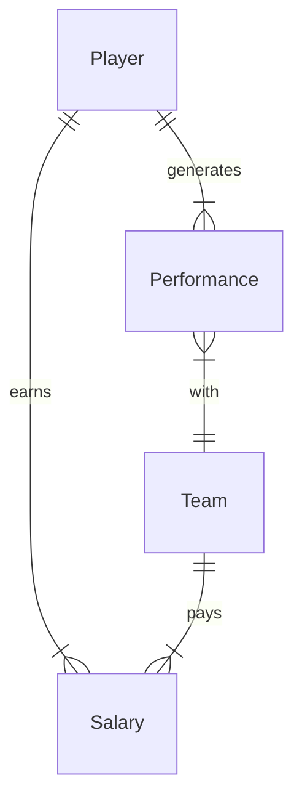

# Moneyball

> Il s'agit de réduire les choses à un seul chiffre. En utilisant les statistiques comme nous les lisons, nous trouverons la valeur des joueurs que personne d'autre ne peut voir.
>
> Peter Brand dans Moneyball

## Problème à Résoudre

Nous sommes en 2001. Vous avez été embauché pour aider à tirer le meilleur parti du budget limité de l'équipe de baseball des Oakland Athletics. Chaque année, des équipes comme les "A's" engagent de nouveaux joueurs de baseball. Malheureusement, vous manquez de joueurs vedettes — et de fonds. Cependant, avec un peu de SQL et de chance, qui dit que vous ne pouvez pas créer une équipe qui défie les attentes ?

Avec une base de données appelée `moneyball.db` — qui contient des informations sur les joueurs, leurs performances (performances) et leurs salaires (salaries) — aidez les Oakland Athletics à trouver la valeur des joueurs que les autres pourraient manquer.

## Schéma

`moneyball.db` représente tous les joueurs (players), équipes (teams), salaires (salaries) et performances (performances) de la Ligue Majeure de Baseball jusqu'en 2001. En particulier, `moneyball.db` représente les entités suivantes :

- Un joueur (player), qui inclut toute personne ayant joué en Ligue Majeure de Baseball pendant une période quelconque
- Une équipe (team), qui inclut toutes les équipes, passées et présentes, en Ligue Majeure de Baseball
- Une performance (performance), qui décrit les types de coups sûrs (hits) qu'un joueur a réalisés pour son équipe une année donnée
- Un salaire (salary), qui est le montant d'argent qu'une équipe a payé à l'un de ses joueurs une année donnée

Ces entités sont liées selon le diagramme de relation d'entité (ER) ci-dessous :



### Table `players`

La table `players` contient les colonnes suivantes :

- `id`, qui est l'ID du joueur (player)
- `first_name`, qui est le prénom du joueur (first name)
- `last_name`, qui est le nom de famille du joueur (last name)
- `bats`, qui est le côté ("R" pour droit ou "L" pour gauche) avec lequel le joueur frappe (bats)
- `throws`, qui est la main ("R" pour droit ou "L" pour gauche) avec laquelle le joueur lance (throws)
- `weight`, qui est le poids du joueur en livres (pounds)
- `height`, qui est la taille du joueur en pouces (inches)
- `debut`, qui est la date (exprimée sous la forme `YYYY-MM-DD`) à laquelle le joueur a commencé sa carrière en MLB (debut)
- `final_game`, qui est la date (exprimée sous la forme `YYYY-MM-DD`) à laquelle le joueur a joué son dernier match en MLB (final game)
- `birth_year`, qui est l'année de naissance du joueur (birth year)
- `birth_month`, qui est le mois (exprimé sous la forme d'un entier) de naissance du joueur (birth month)
- `birth_day`, qui est le jour de naissance du joueur (birth day)
- `birth_city`, qui est la ville de naissance du joueur (birth city)
- `birth_state`, qui est l'État de naissance du joueur (birth state)
- `birth_country`, qui est le pays de naissance du joueur (birth country)

### Table `teams`

La table `teams` contient les colonnes suivantes :

- `id`, qui est l'ID de chaque équipe (team)
- `year`, qui est l'année de fondation de l'équipe (year founded)
- `name`, qui est le nom de l'équipe (name)
- `park`, qui est le nom du parc où l'équipe joue (ou a joué) (park)

### Table `performances`

La table `performances` contient les colonnes suivantes :

- `id`, qui est l'ID de la performance (performance)
- `player_id`, qui est l'ID du joueur (player) qui a généré la performance (performance)
- `team_id`, qui est l'ID de l'équipe (team) pour laquelle le joueur a généré la performance (performance)
- `year`, qui est l'année à laquelle le joueur a généré la performance (year)
- `G`, qui est le nombre de matchs joués (games played) par le joueur, pour l'équipe donnée, l'année donnée
- `AB`, qui est le nombre de "at bats" (passages à la batte) du joueur, pour l'équipe donnée, l'année donnée
- `H`, qui est le nombre de coups sûrs (hits) du joueur, pour l'équipe donnée, l'année donnée
- `2B`, qui est le nombre de doubles (coups sûrs de deux bases) du joueur, pour l'équipe donnée, l'année donnée
- `3B`, qui est le nombre de triples (coups sûrs de trois bases) du joueur, pour l'équipe donnée, l'année donnée
- `HR`, qui est le nombre de coups de circuit (home runs) du joueur, pour l'équipe donnée, l'année donnée
- `RBI`, qui est le nombre de "runs batted in" (points produits) du joueur, pour l'équipe donnée, l'année donnée
- `SB`, qui est le nombre de buts volés (stolen bases) du joueur, pour l'équipe donnée, l'année donnée

### Table `salaries`

La table `salaries` contient les colonnes suivantes :

- `id`, qui est l'ID du salaire (salary)
- `player_id`, qui est l'ID du joueur (player) gagnant le salaire (salary)
- `team_id`, qui est l'ID de l'équipe (team) payant le salaire (salary)
- `year`, qui est l'année pendant laquelle le salaire (salary) a été payé
- `salary`, qui est le salaire (salary) lui-même en dollars américains (non ajusté pour l'inflation)

## Spécification

##### `1.sql`

Vous devriez commencer par vous faire une idée de l'évolution des salaires moyens des joueurs au fil du temps. Dans `1.sql`, écrivez une requête SQL pour trouver le salaire moyen des joueurs par année (year).

- Triez par année (year) en ordre décroissant.
- Arrondissez le salaire (salary) à deux décimales et appelez la colonne "salaire moyen" (average salary).
- Votre requête doit retourner une table avec deux colonnes, une pour l'année (year) et une pour le salaire moyen (average salary).

##### `2.sql`

Votre directeur général (c'est-à-dire la personne qui prend des décisions sur les contrats des joueurs) vous demande si l'équipe devrait échanger un joueur actuel contre Cal Ripken Jr., une star qui approche probablement de sa retraite. Dans `2.sql`, écrivez une requête SQL pour trouver l'historique des salaires (salary history) de Cal Ripken Jr.

- Triez par année (year) en ordre décroissant.
- Votre requête doit retourner une table avec deux colonnes, une pour l'année (year) et une pour le salaire (salary).

##### `3.sql`

Votre équipe a besoin d'un excellent frappeur de coups de circuit (home run hitter). Ken Griffey Jr., un lauréat de longue date du Silver Slugger et du Gold Glove, pourrait être un bon prospect. Dans `3.sql`, écrivez une requête SQL pour trouver l'historique des coups de circuit (home run history) de Ken Griffey Jr.

- Triez par année (year) en ordre décroissant.
- Notez qu'il peut y avoir deux joueurs portant le nom "Ken Griffey." Ce Ken Griffey est né en 1969.
- Votre requête doit retourner une table avec deux colonnes, une pour l'année (year) et une pour les coups de circuit (home runs).

##### `4.sql`

Vous devez faire une recommandation sur les joueurs que l'équipe devrait envisager d'engager. Avec le budget limité de l'équipe, le directeur général veut savoir quels joueurs ont été les moins bien payés en 2001. Dans `4.sql`, écrivez une requête SQL pour trouver les 50 joueurs les moins bien payés en 2001.

- Triez les joueurs par salaire (salary), du plus bas au plus élevé.
- Si deux joueurs ont le même salaire (salary), triez par ordre alphabétique par prénom (first name) puis par nom de famille (last name).
- Si deux joueurs ont le même prénom (first name) et nom de famille (last name), triez par ID du joueur (player ID).
- Votre requête doit retourner trois colonnes, une pour les prénoms des joueurs (first names), une pour leurs noms de famille (last names) et une pour leurs salaires (salaries).

##### `5.sql`

C'est une journée un peu calme au bureau. Bien que Satchel ne joue plus, dans `5.sql`, écrivez une requête SQL pour trouver toutes les équipes (teams) pour lesquelles Satchel Paige a joué.

- Votre requête doit retourner une table avec une seule colonne, une pour les noms des équipes (names of the teams).

##### `6.sql`

Quelles équipes pourraient être les plus grandes concurrentes des A's cette année ? Dans `6.sql`, écrivez une requête SQL pour retourner les 5 meilleures équipes (top 5 teams), triées par le nombre total de coups sûrs (total hits) réalisés par les joueurs en 2001.

- Appelez la colonne représentant le nombre total de coups sûrs (total hits) réalisés par les joueurs en 2001 "total hits" (total hits).
- Triez par nombre total de coups sûrs (total hits), du plus élevé au plus bas.
- Votre requête doit retourner deux colonnes, une pour les noms des équipes (names of the teams) et une pour leurs coups sûrs totaux (total hits) en 2001.

##### `7.sql`

Vous devez faire une recommandation sur le ou les joueurs à éviter de recruter. Dans `7.sql`, écrivez une requête SQL pour trouver le nom du joueur (player) qui a été le mieux payé de tous les temps en Ligue Majeure de Baseball (Major League Baseball).

- Votre requête doit retourner une table avec deux colonnes, une pour le prénom du joueur (first name) et une pour son nom de famille (last name).

##### `8.sql`

Combien les A's devraient-ils payer pour obtenir le meilleur frappeur de coups de circuit (home run hitter) de la saison dernière ? Dans `8.sql`, écrivez une requête SQL pour trouver le salaire de 2001 (2001 salary) du joueur qui a frappé le plus de coups de circuit (home runs) en 2001.

- Votre requête doit retourner une table avec une colonne, le salaire (salary) du joueur.

##### `9.sql`

Quels salaires les autres équipes paient-elles ? Dans `9.sql`, écrivez une requête SQL pour trouver les 5 équipes les moins bien payées (par salaire moyen) en 2001.

- Arrondissez la colonne du salaire moyen (average salary) à deux décimales et appelez-la "salaire moyen" (average salary).
- Triez les équipes par salaire moyen (average salary), du plus bas au plus élevé.
- Votre requête doit retourner une table avec deux colonnes, une pour les noms des équipes (names of the teams) et une pour leur salaire moyen (average salary).

##### `10.sql`

Le directeur général vous a demandé un rapport détaillant le nom de chaque joueur (player), son salaire (salary) pour chaque année où il a joué, et son nombre de coups de circuit (home runs) pour chaque année où il a joué. Pour être précis, le tableau doit inclure :

- Les prénoms de tous les joueurs (first names of all players)
- Les noms de famille de tous les joueurs (last names of all players)
- Les salaires de tous les joueurs (salaries of all players)
- Les coups de circuit de tous les joueurs (home runs of all players)
- L'année (year) à laquelle le joueur a été payé ce salaire (salary) et a frappé ces coups de circuit (home runs)

Dans `10.sql`, écrivez une requête pour retourner un tel tableau.

- Votre requête doit retourner une table avec cinq colonnes, selon ce qui précède.
- Triez les résultats, d'abord et avant tout, par ID des joueurs (player IDs) (du plus bas au plus élevé).
- Triez les lignes concernant le même joueur par année (year), en ordre décroissant.
- Considérez un cas particulier : supposons qu'un joueur ait plusieurs salaires (salaries) ou performances (performances) pour une année donnée. Triez-les d'abord par nombre de coups de circuit (home runs), en ordre décroissant, puis par salaire (salary), en ordre décroissant.
- Assurez-vous que, pour une seule ligne, l'année (year) du salaire (salary) et l'année (year) de la performance (performance) correspondent.

##### `11.sql`

Vous avez besoin d'un joueur qui peut obtenir des coups sûrs (hits). Qui pourrait être le plus sous-estimé ? Dans `11.sql`, écrivez une requête SQL pour trouver les 10 joueurs les moins chers par coup sûr (hit) en 2001.

- Votre requête doit retourner une table avec trois colonnes, une pour les prénoms des joueurs (first names), une pour leurs noms de famille (last names) et une appelée "dollars par coup sûr" (dollars per hit).
- Vous pouvez calculer la colonne "dollars par coup sûr" (dollars per hit) en divisant le salaire (salary) d'un joueur en 2001 par le nombre de coups sûrs (hits) qu'il a réalisés en 2001. Rappelez-vous que vous pouvez utiliser `AS` pour renommer une colonne.
- Diviser un salaire (salary) par 0 coup sûr (hit) donnera une valeur `NULL`. Évitez le problème en filtrant les joueurs avec 0 coup sûr (hit).
- Triez la table par la colonne "dollars par coup sûr" (dollars per hit), du moins cher au plus cher. Si deux joueurs ont le même "dollars par coup sûr" (dollars per hit), triez par prénom (first name), puis par nom de famille (last name), par ordre alphabétique.
- Comme dans `10.sql`, assurez-vous que l'année (year) du salaire (salary) et l'année (year) de la performance (performance) correspondent.
- Vous pouvez supposer, pour simplifier, qu'un joueur n'aura qu'un seul salaire (salary) et une seule performance (performance) en 2001.

##### `12.sql`

Les coups sûrs (hits) sont formidables, mais les RBIs (runs batted in) le sont aussi ! Dans `12.sql`, écrivez une requête SQL pour trouver les joueurs parmi les 10 moins chers par coup sûr (hit) et parmi les 10 moins chers par RBI en 2001.

- Votre requête doit retourner une table avec deux colonnes, une pour les prénoms des joueurs (first names) et une pour leurs noms de famille (last names).
- Vous pouvez calculer le salaire (salary) d'un joueur par RBI en divisant son salaire (salary) de 2001 par son nombre de RBIs en 2001.
- Vous pouvez supposer, pour simplifier, qu'un joueur n'aura qu'un seul salaire (salary) et une seule performance (performance) en 2001.
- Triez vos résultats par ID du joueur (player ID), du plus bas au plus élevé (ou par ordre alphabétique par nom de famille (last name), car les deux sont identiques dans ce cas !).
- Gardez à l'esprit les leçons apprises dans `10.sql` et `11.sql` !

## Utilisation

Pour tester vos requêtes au fur et à mesure que vous les écrivez dans vos fichiers `.sql`, vous pouvez interroger la base de données en exécutant :

```
.read FILENAME
```

où `FILENAME` est le nom du fichier contenant votre requête SQL. Par exemple,

```
.read 1.sql
```

Vous pouvez également exécuter :

```
$ cat FILENAME | sqlite3 moneyball.db > output.txt
```

pour rediriger la sortie de la requête vers un fichier texte nommé `output.txt`. (Cela peut être utile pour vérifier combien de lignes sont retournées par votre requête !)

## Remerciements

Récit adapté du livre de Michael Lewis, Moneyball : The Art of Winning an Unfair Game. Données adaptées de la Lahman Baseball Database, sous licence Creative Commons Attribution-ShareAlike 3.0 Unported License.

