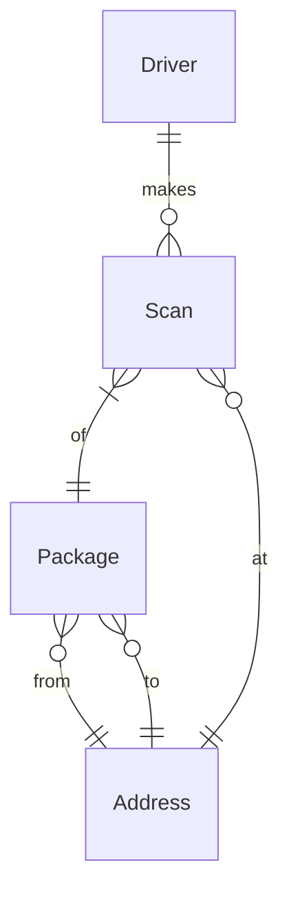

# Livraisons, S'il Vous Plaît


## Problème à Résoudre

Vous êtes un employé de bureau de poste pour la ville de Boston et, à ce titre, vous supervisez la livraison du courrier dans toute la ville. Pour la plupart, tous les colis envoyés sont finalement livrés. Sauf que, de temps en temps, un mystère vous tombe dessus : un colis manquant ! Pour chaque client qui vient vous signaler un colis manquant, votre travail consiste à déterminer :

- L'adresse actuelle (ou l'emplacement !) de leur colis manquant
- Le type d'adresse ou d'emplacement (par exemple, résidentiel, commercial, etc.)
- Le contenu du colis

Tout ce que vous savez est ce que les clients eux-mêmes vous diront. Pour résoudre chaque mystère, vous devrez utiliser la base de données du service de livraison de courrier, `packages.db`, qui contient des données sur le transit des colis dans la ville. En utilisant uniquement les informations de la base de données, votre tâche est d'aider chaque client à retrouver son colis manquant.

## Distribution du Code

Pour ce problème, vous devrez utiliser `packages.db`, ainsi qu'un fichier `.sql` et un fichier `.txt` dans lesquels vous écrirez vos requêtes et réponses.

## Schéma

`packages.db` représente toutes les livraisons de colis récentes dans la ville de Boston. Pour ce faire, `packages.db` représente les entités suivantes :

- Chauffeurs, qui sont les personnes qui livrent les colis
- Les colis eux-mêmes
- Adresses, comme 1234 Main Street
- Scans des colis, qui représentent des confirmations qu'un chauffeur de livraison a pris ou déposé un colis donné

Ces entités sont liées selon le diagramme de relation d'entité (ER) ci-dessous :



### Table `addresses`

La table `addresses` contient les colonnes suivantes :

- `id`, qui est l'ID de l'adresse
- `address`, qui est l'adresse elle-même (par exemple, 7660 Sharon Street)
- `type`, qui est le type d'adresse (par exemple, résidentiel, commercial, etc.)

### Table `drivers`

La table `drivers` contient les colonnes suivantes :

- `id`, qui est l'ID du chauffeur
- `name`, qui est le prénom du chauffeur

### Table `packages`

La table `packages` contient les colonnes suivantes :

- `id`, qui est l'ID du colis
- `contents`, qui contient le contenu du colis
- `from_address_id`, qui est l'ID de l'adresse d'où le colis a été envoyé
- `to_address_id`, qui est l'ID de l'adresse à laquelle le colis a été envoyé. Ce n'est pas nécessairement là où il a fini !

### Table `scans`

La table `scans` contient les colonnes suivantes :

- `id`, qui est l'ID du scan
- `driver_id`, qui est l'ID du chauffeur qui a créé le scan
- `package_id`, qui est l'ID du colis scanné
- `address_id`, qui est l'ID de l'adresse où le colis a été scanné
- `action`, qui indique si le colis a été pris en charge ("Pick") ou déposé ("Drop")
- `timestamp`, qui est le jour et l'heure auxquels le colis a été scanné

## Spécification

Pour ce problème, il est tout aussi important de trouver les colis que le processus que vous utilisez pour le faire. Dans `log.sql`, gardez une trace de toutes les requêtes SQL que vous exécutez sur la base de données. Au-dessus de chaque requête, étiquetez-la avec un commentaire : en SQL, les commentaires sont toutes les lignes qui commencent par `--`, comme suit :

```sqlite
-- Ceci est un commentaire SQL
```

Le commentaire doit décrire pourquoi vous exécutez la requête et quelles informations vous espérez obtenir de cette requête particulière. Vous pouvez également utiliser des commentaires pour ajouter des notes supplémentaires sur votre processus de réflexion lorsque vous résolvez chaque mystère : en fin de compte, ce fichier doit servir de preuve du processus que vous avez utilisé pour trouver chaque colis !

Une fois que vous avez trouvé l'emplacement d'un colis, complétez chacune des lignes dans `answers.txt` en remplissant les détails sur l'emplacement du colis, ainsi que son contenu. Assurez-vous de ne pas modifier le texte existant dans le fichier ou d'ajouter d'autres lignes au fichier !

### La Lettre Perdue

Votre premier rapport de colis manquant provient d'Anneke. Anneke s'approche de votre comptoir et vous dit ce qui suit :

> Monsieur, je m'appelle Anneke. J'habite au 900 Somerville Avenue. Il n'y a pas longtemps, j'ai envoyé une lettre spéciale. Elle est destinée à mon amie Varsha. Elle commence un nouveau chapitre de sa vie au 2 Finnegan Street, en centre-ville. (Cette adresse, laissez-moi vous dire : elle était un peu difficile à obtenir correctement la première fois.) La lettre est un mot de félicitations—une petite accolade en papier de moi à elle, pour célébrer ce grand déménagement. Pouvez-vous vérifier si elle est arrivée jusqu'à elle ?

Dans `log.sql`, sous `-- *** La Lettre Perdue ***`, gardez une trace des requêtes SQL que vous utilisez pour trouver la lettre perdue d'Anneke. Une fois que vous l'avez trouvée, décrivez-la selon les questions dans `answers.txt`.

### La Livraison Malicieuse

Votre deuxième rapport de colis manquant provient d'un individu mystérieux d'une ville voisine. Il s'approche de votre comptoir et vous dit ce qui suit :

> Bonjour, M. le livreur. Vous vous souvenez peut-être qu'il n'y a pas longtemps, je suis venu de la ville de Fiftyville. J'ai remis une certaine boîte entre vos mains et vous ai demandé de rester discret. Mon associé attend ce colis depuis un moment maintenant. Et pourtant, il semble avoir disparu. Ha ! Y a-t-il une chance que vous puissiez éclaircir ce mystère ? Désolé, il n'y a pas d'adresse "De".

Dans `log.sql`, sous `-- *** La Livraison Malicieuse ***`, gardez une trace des requêtes SQL que vous utilisez pour trouver le colis. Une fois que vous l'avez trouvé, décrivez-le selon les questions dans `answers.txt`.

### Le Cadeau Oublié

Votre troisième rapport de colis manquant provient d'un grand-parent qui habite près du bureau de poste. Il s'approche de votre comptoir et vous dit ce qui suit :

> Oh, excusez-moi, Agent. J'avais envoyé un cadeau mystère, voyez-vous, à ma merveilleuse petite-fille, au 728 Maple Place. C'était il y a environ deux semaines. Maintenant, la date de livraison est passée de sept jours entiers et j'apprends qu'elle attend toujours, les mains vides et le cœur rempli d'anticipation. Je suis un peu inquiet et je me demande où mon colis est passé. Je ne me souviens pas pour la vie de moi ce qu'il y a à l'intérieur, mais je sais qu'il est rempli à ras bord de mon amour pour elle. Pourrions-nous éventuellement le retrouver pour qu'il puisse remplir sa journée de joie ? Je l'ai envoyé de chez moi au 109 Tileston Street.

Dans `log.sql`, sous `-- *** Le Cadeau Oublié ***`, gardez une trace des requêtes SQL que vous utilisez pour trouver le cadeau. Une fois que vous l'avez trouvé, décrivez-le selon les questions dans `answers.txt`.
